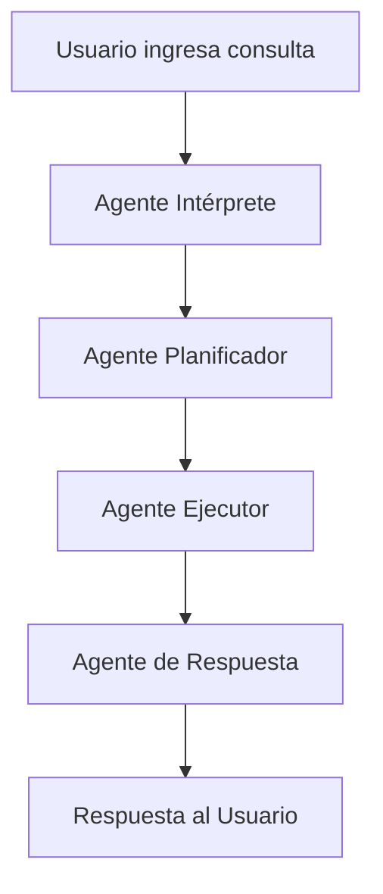

# Sistema Multi-Agente SERFOR

Sistema inteligente para consultas sobre datos forestales y de fauna silvestre utilizando InstantNeo, múltiples agentes especializados y un sistema dinámico de descubrimiento de esquemas de base de datos.

## Arquitectura del Sistema

El sistema está compuesto por 6 componentes principales:

### 1. **Agente Intérprete** (`InterpreterAgent`)
- **Función**: Analiza y comprende las consultas del usuario
- **Salida**: Extrae intent, entidades, filtros y formato deseado
- **Especialización**: Procesamiento de lenguaje natural específico para dominio forestal

### 2. **Agente Planificador** (`PlannerAgent`)
- **Función**: Crea planes de ejecución paso a paso
- **Entrada**: Interpretación estructurada de la consulta
- **Salida**: Plan detallado con pasos ejecutables
- **Especialización**: Conoce la estructura de la BD y operaciones disponibles

### 3. **Agente Ejecutor** (`ExecutorAgent`)
- **Función**: Ejecuta consultas y operaciones en la base de datos
- **Herramientas**: Skills especializadas para interactuar con SERFOR_BDDWH
- **Especialización**: Operaciones CRUD, validaciones, transformaciones

### 4. **Agente de Respuesta** (`ResponseAgent`)
- **Función**: Formatea resultados en respuestas comprensibles
- **Entrada**: Resultados de ejecución
- **Salida**: Respuesta final formateada para el usuario
- **Especialización**: Creación de tablas, gráficos, resúmenes

### 5. **Agente de Esquemas** (`SchemaAgent`)
- **Función**: Analiza y enriquece esquemas de base de datos
- **Especialización**: Proporciona descripciones inteligentes de tablas y columnas
- **Capacidades**: Sugiere patrones de consulta, valida factibilidad de queries

### 6. **Orquestador** (`AgentOrchestrator`)
- **Función**: Coordina el flujo de trabajo entre todos los agentes
- **Responsabilidades**: Gestión de errores, logging, coordinación

## Estructura de Archivos

```
agents/
├── __init__.py
├── base_agent.py           # Clase base para todos los agentes
├── interpreter_agent.py    # Agente intérprete
├── planner_agent.py       # Agente planificador con gestión de tareas
├── executor_agent.py      # Agente ejecutor con skills de BD
├── response_agent.py      # Agente de respuesta
├── schema_agent.py        # Agente de análisis de esquemas
├── task_manager.py        # Sistema de gestión de tareas
└── orchestrator.py        # Orquestador del sistema

database/
├── __init__.py
├── schema_mapper.py       # Mapeo dinámico de esquemas
├── connection_manager.py  # Gestión de conexiones SQL Server
└── skills.py             # Skills flexibles para base de datos

main_agents.py             # Punto de entrada principal
setup_database.py         # Script de configuración inicial
test_task_system.py       # Tests del sistema de tareas
requirements.txt           # Dependencias del proyecto
```

## Uso Básico

### 1. Configuración Inicial

```bash
# Instalar dependencias
pip install -r requirements.txt

# Configurar variables de entorno
cp .env.example .env
# Editar .env con tu OPENAI_API_KEY

# Configurar base de datos (asegurar que Docker esté ejecutándose)
python setup_database.py
```

### 2. Usar el Sistema

```python
from agents.orchestrator import AgentOrchestrator

# Crear orquestador
orchestrator = AgentOrchestrator()

# Procesar consulta
result = orchestrator.process_user_query("¿Cuántos infractores hay en Lima?")

print(result["final_response"])
```

### 3. Interfaz Interactiva

```bash
python main_agents.py
```

## Ejemplos de Consultas

El sistema puede manejar consultas como:

- **Estadísticas básicas**: "¿Cuántos infractores hay registrados?"
- **Filtros geográficos**: "Muestra infractores de Lima en 2022"
- **Comparaciones**: "Compara infracciones entre Lima y Cusco"
- **Análisis temporal**: "Tendencia de infracciones por mes"
- **Consultas específicas**: "Infracciones relacionadas con títulos habilitantes vencidos"

## Configuración

### Variables de Entorno

Crea un archivo `.env` con:

```env
OPENAI_API_KEY=tu_api_key_aqui
```

### Dependencias

```bash
pip install instantneo[openai]
pip install python-dotenv
```

## Flujo de Procesamiento



1. **Interpretación**: Extrae intent y parámetros
2. **Planificación**: Crea plan de ejecución
3. **Ejecución**: Realiza consultas a la BD
4. **Formateo**: Presenta resultados al usuario

## Características Avanzadas

### 🔄 **Sistema de Gestión de Tareas**
- Tareas con estados: `pending`, `in_progress`, `completed`, `failed`
- Dependencias entre tareas
- Reintentos automáticos con límites configurables
- Recuperación automática de errores
- Logging detallado de ejecución

### 🗄️ **Descubrimiento Dinámico de Esquemas**
- Mapeo automático de estructuras de base de datos
- Enriquecimiento con IA de descripciones de tablas y columnas
- Cache persistente de información de esquemas
- Actualización automática cuando se agregan nuevas tablas

### 🛠️ **Skills Flexibles de Base de Datos**
- `execute_select_query`: Consultas SQL seguras
- `get_table_schemas`: Información de esquemas
- `search_table_data`: Búsquedas con filtros flexibles
- `aggregate_table_data`: Agregaciones (COUNT, SUM, AVG, etc.)
- `count_table_rows`: Conteos de registros
- `get_table_sample`: Muestras de datos

## Próximos Pasos

- [ ] Implementar cache de resultados para consultas frecuentes
- [ ] Añadir métricas y monitoring de performance
- [ ] Crear tests unitarios completos
- [ ] Implementar validación avanzada de consultas
- [ ] Agregar soporte para gráficos y visualizaciones

## Base de Datos

El sistema trabaja con la base de datos `SERFOR_BDDWH` que contiene:

- **Dir.T_GEP_INFRACTORES**: Datos de infractores forestales
- **Dir.T_GEP_TITULOHABILITANTE**: Información de títulos habilitantes

Ver `README-Docker.md` para instrucciones de configuración de la base de datos.